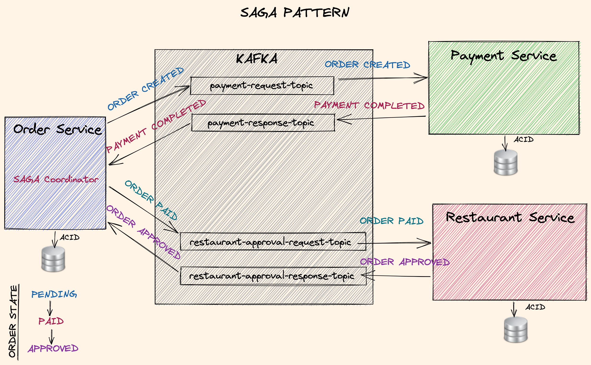

# microservices-clean-architecture-ddd-saga-outbox-kafka

## Introduction

- Microservices

  - well-focused, fine-grained services that expose a lighweight protocol, e.g. HTTP
  - pros
    - independent development and deployment lifecycle (different teams can be in charge of them)
    - easy to scale up
    - better fault isolation
    - enables us to use different stacks for different services
  - they are developed in a distributed system, so that requires the use of microservice patterns and orchestration tools for common problems

### Clean architecture

- isolated domain logic from external dependencies (databases, message queues) and runtime tools
  - proposed by Robert Martin in 2012
  - depedency inversion - high level modules should not depend on low level modules. Both should depend on abstractions.
- Hexagonal architecture (ports and adapters):
  - invented by Alistair Cockburn in 2005
  - rely on well-defined interfaces called ports and implementing interfaces with replaceable adapters
- Onion architecture - similar to hexagonal architecture, the idea is to isolate the domain logic from outside dependencies

### Domain-driven design

- mapping the business domain and bounded context for the domain model
- tactical DDD - implement the domain model with `Aggregates`, `Entities`, `Value Objects`, `Services` and `Events`
- Kafka: an event store for event-driven services. Enables loosely coupled services that communicate through events.
- SAGA: distributed long running transactions accross services. Used for Long lived transactions (LLT). First invented in a publication in 1987
  - ACID transaction - guarantees that a database will be in a consistent state after running a group of operations
  - Choreography-based SAGA: based on events - local transactions publish domain events that trigger local transactions in other services
  - Orchestration-based SAGA: orchestrator coordinates the participants to run local transactions
  - Frameworks: Eventuate or Axon
- Outbox: helps the use of local ACID transactions to let consistent (eventual) distributed transactions. It will complete SAGA in a safe and consistent way.
  - the problem: local ACID transaction + Event publishing operation
  - Scenario 1: database transaction commited successfully and an event publishing failed -> SAGA cannot continue (incosistent state, one transaction happened, the other one did not even start)
  - Scenario 2: event published and reached to target successfully. After that the database transaction failed. Practically, the first transaction failed, the other one passed.
  - Solutions:
    1. direct event sourcing: use an event log as the primary source for your data. So, no database, but an event log as a data source. In practise, in most cases, we will need the local db transaction, especially if we have hard ACID needs, like monetary operations.
    2. Outbox pattern: instead of publishing the events directly, we store them in a local database table called an **Outbox table**. This table belongs to the same local database of the service used for local transactions.
    - run a single ACID transaction for a local DB transaction + Insertion into an `Outbox table`
    - to publish an event, we read the data from outbox table; two approaches
      1. pulling the data from an outbox table (poll it periodically)
      2. using CDC - Change Data Capture: listens transaction logs of the outbox table
- CQRS (Command Query Responsibility Segregation): separate read and write operations.
  - Better performance on read part using the right technology for reading and preventing conflicts with update commands -> develop, manage and scale read and write parts of a system
  - Scales each part separately.
  - Leads to evental consistency (some delay between the data propagation from write to read storage).
  - Outbox pattern should be used with this pattern as well to guarantee the consistency


- to achieve the hexagonal (clean) architecture, every service will be deployed in multiple units - every service has multiple layers, those will be deployable modules
- Primary adapters::input ports-> Domain (business) logic - REST API
- Secondary adapter::output ports -> messaging and data access
- Domain-driven design
  - **Aggregates** - a group of objects which always needs to be consistent
  - **Entitites** - aggregation happens through entity objects
  - **Value objects** - define simple immutable objects with domain-driven names. They do not contain identifiers, only values
  - **Domain services** - handle business object that spans multiple aggregate routes and logic that cannot fit into any entity by nature
  - **Application services** - point of contact to outer world of a domain that wants to communicate with the domain layer
  - **Domain events** - send notifications to other services which run in different bounded contexts

## Clean architecutre and Hexagonal architecture

### Clean architecture

- separation of concerns by diving the software into different layers
- use Dependency inversion and Polymorphism to create a dependency rule to make the domain layer the most independent and stable layer
- Dependency inversion - high-level modules should not depend on low-level modules
- source code dependencies can only point inward, towards the domain layer
  
- independent of frameworks, UI, database and any external components
- the end result: testable domain layer
- define entities and use cases for domain logic
- the same high level principle is achieved with hexagonal and onion architectures: Isolate the domain

### Hexagonal architecture

- also known as `Ports and Adapters`; Ports (interfaces) and Adapters which implement the ports
- separate insides (domain layer) and outsides (infrastructure layers); isolate domain from any dependency such as UI, data layer, message queue, client components, external APIs or even a framework like Spring
- domain layer which holds the business logic is developed first and it will not depend on any other layer; again the domain layer should be the most independent and stable component of a system
- so, our software is only the domain layer, i.e. business logic
- all other parts (database, queue, client services...) are just plugins to our software
- invented in 2005 by Alistair Cockburn
  > Allow an application to be equally driven by users, programs , automated test or batch scripts, and to be developed and tested in isolation from its eventual runtime devices and databases
-  <br>
- two types of adapters:
  1. primary/driving adapters - use the core logic that is in domain layer. They use the input ports to call the implementations that are defined in the domain layer.
  2. secondary/driven adapters - implemented in external modules like database or message queue. These are called by business logic to complete external tasks. The results of such tasks can be returned back to an end user through the primary adapters.
- adapters are interchangeable components
- we use interfaces on both input and output and dependency injection is used to pass the implementation of the secondary adapters to the core logic
- input ports are implemented in the domain layer, but is not the adapter itself, whilst output ports are implemented by secondary adapters with infrastructure modules

### Advantages of Clean & Hexagonal architecture

- good for mainly long lasting applications
- Clean architecture - leaves as many options open as possible for as long as possible
  - we have to keep track of technological changes to keep up with evolving changes
  - we can decide to change one relational database with another or use a NoSQL database. If our business logic is separated, we can easily do any such transformation (e.g. change the data source)
- in a traditional 3-tier architecture

1. presentation layer
2. business layer
3. data layer

- dependencies are stacked on top of each other, upper layer is dependent on the layer below, eventually pointing to data layer. The idea is to have an upper layer (high-level module) independent of a lower layer (low-level module)
- with Clean architecture, all dependency arrows point to business layer, making it independent and stable
- with Clean architecture, we can delay the implementation details of dependencies (use abstractions and delay with any constraint of any data source or framework)
- easier to test the business logic by mocking the dependencies even before deciding the implementation details
- we can easily replace an adapter implementation, without touching the business logic
- every layer can be maintained separately without touching other layers
- independent development and deployment of different parts

#### Drawback

- writing more code, even duplicating some portions of it

### Business logic in Clean architecture

- **Entities**: Objects that embodies a small set of critical business rules (e.g. for an order that would validate whether we have it in stock, check the total price) and has the core business logic.
- **Use Cases**: describes the **application-specific business rules** (e.g. having a discount on an item temporarily, setting a daily purchase limit, etc). Contains the rules that specify how and when the Critical Business Rules within the Entities are invoked.
  Orchestrates the flow of data and from the entities, and direct those entities to use their Critical Business Rules to achieve the goals of the use case.

### Clean architecture and Domain-driven design

- in Clean architecture we have:
  - Entities as main components of the domain layer
  - Use cases that orchestrates Entities and the use of their Critical Business rules to achieve the goals of the use case.
- In DDD, we have:
  - Entities with an Aggregate root - main entity that orchestrate the core business rule of the current context. This context is called as **Bounded context** - boundary within a domain with a particular domain model.
    - **Aggregate** - a group of domain objects that always needs to be in consistent state. Therefore, we should save and update Aggregate as a whole inside a transaction. Aggregate root is a class which works as an entry point to our Aggregate and all business operations should go through the root. This way the Aggregate root will make sure that the Aggregate is in a consistent state.
  - **Domain Services** - equivalent to Use cases in Clean architecture. That is a business logic that spans multiple Aggregate roots, so that they can be implemented in a single Bounded context. It can also include the business logic that spans multiple entities and the logic that doesn't fit to an entity.
  - **Application service** - it exposes the required business layer methods to the outside using ports (first contact point from outside to domain layer) and these ports will be implemented in the domain layer itself.
    - In this layer we can also have data mappings, validations, transaction management and security.
    - responsible to make any data adapter calls and gather the data to pass into domain service and entities

 <br>
<br>

- Dependency inversion principle allows to revert any runtime dependency. It will lead to having an independent domain layer.

## Domain-Driven Design

- offers solutions to common problem when building an enterprise software
- Domain model: a conceptual model of the domain that defines the behaviour and data of a system
- the main idea is to separate the business model from the infrastructure
- domain model - in the center of the software. Independent from other dependencies. Keep the domain model stable and independent of infrastructure components, so we can easily change and replace them, even adapt to new technologies easily.

 <br>

- **Strategic DDD** vs **Tactical DDD**
- `Strategic DDD`: introduces boundaries for domain model. Single Bounded context per each domain.
  - What is a Domain? Operational area of your application, e.g. Online food ordering. Domain can have one or more subdomains depending on the logic.
  - Bounded context: Central pattern in DDD. Bounded within a Domain. It will help to group the functionalities of a system. (e.g. order processing and payment processing)
  - Ubiquitous Language: Common language used by domain experts and developers
- `Tactical DDD`: implementation patterns

  - **Entities**:

    - Domain object with a unique identity (unique identifier assigned to it when created, remains unchanged; practically two entities with the same identifier are treated like having the same object even if all other fields are different).
    - Embodies a set of critical business rules.
    - They are mutable, it is possible to set value of their properties using a a well-defined state-change methods.

  - **Aggregates:**

    - Group of Entity objects which always need to be in consistent sate. Example: Order processing aggregate - order, order item and product.
    - It should be retrieved and stored as a whole in a consistent state.

  - **Aggregate Root (AR)**:

    - Entry point Entity for an aggregate that should keep aggregate in a consistent state all the time.
    - All business operations should go through the root.
    - An Aggregate should be referenced from outside only through its root.
    - AR should have pure, side-effetc free functions.
    - Practically AR owns an Aggregate. An identifier of AR also identifies an Aggregate.
    - AR is responsible to enforce business invariants.
    - Since all state-changing operations should go through an AR, before saving an aggregate, it should enforce strict validations each time to keep the aggregate in consistent state.
    - use data store constraints and optimistic locking to prevent data loss or corrupted data in case of conflicting updates by multiple threads
    - how to choose AR from a group of Aggregates? Consider if the entitiy will be modified independently and can be accessed by the identifier from the outside (from other aggregates)

  - **Value Objects**:

    - Immutable objects without identity. If we want to change its value, we have to create a new object with updated value. That's why they are interchangeable - you can use two different VO with the same value for the same purpose.
    - Only value matters.
    - Brings context to the value (e.g. to keep a price of an order instead of BigDecimal). In this way we can have a business logic on Value objects through their methods (compared to primitive types for an example). Also, we can add validation in their constructors.

  - **Domain Events**:

    - Decouple different domains.
    - Describe things that happen and change the state of a domain.
    - Makes the system extendable.
    - `Domain event listeners` run in a different transactionn than the event publishers.
    - In a domain-driven system, the domain events are an excellent way of achieving an eventual consistency.
    - Any system or module that needs to update itself when something happens in another module or system can subscribe to the domain events coming from that system.
    - Event sourcing: keep the system as an ordered log of events (history)

  - **Domain services**:

    - Business logic that cannot fit in the aggregate.
    - It coordinates the business logic that spans multiple aggregates. Also, we can put some business logic method in it if that method does not fit logically into an entity.
    - Can interact with other domain services.
    - It cannot be reached outside, it is in the core of the domain logic.

  - **Application services**:
    - allows the isolated domain to communicate with outside -> Interface with methods that the outside objects require and expose that interface. We need to implement this application service and accept the request.
    - Orchestrate transaction, security, looking up proper aggregates and saving state changes of the domain to the database,neither domain service nor entities will load this data - it is application serivce's responsibility to get the data and pass it into the domain service or entities.
    - Does not contain any business logic (domain service and entities contain the business logic).
    - `Domain event listener` is a special kind of Application services that is triggered by domain events (not by an end user). Each domain event listener can have a separate domain service (which internall will call the entity to do some business logic) to handle the business logic.

- Good books:
  - **Domain-Drive Design** by Eric Evans
  - **Implementing Domain-Driven Design** - by Vaughn Vernon


- Every port will have its adapter in the domain layer or one of the infrastructure layers

  - input ports: interfaces implemented in the domain layer and used by client of the domain layer
  - output ports: interfaces implemented in the infrastructure layers (data access, messaging modules...) and used by the domain layer to reach those infrastructure layers

- Application service is the first contact point to outside of domain, and it will forward the call to the domain service and entities to complete the business logic

## Kafka

- Kafka brokers: servers run in a cluster (HA and resiliency, replication)
- Topics: logical data unit that holds multiple partitions
- Partitions: the smallest storage unit that holds subset of records
- Producers: writes to end of a specific partition
- Consumers: Reads from a partition using an offset (from start; resilient to cluster restart). A consumer belongs to a consumer group, data is read once per consumer group. So two different consumer groups will read the same data, but within the same consumer group, data is read only once.
- Replication: Resilient and fault tolerant; defined by replication factor. E.g. replication factor 3 with 3 brokers mean that every broker will hold one replica - one partition each. Replication is then a duplication of the same piece of data across different partitions on different nodes
- Scaling: Partition strategy. We can have parallel consumer threads up to the partition number in a topic.
- Immutable append-only event logs (fast because it only append the data)
  <br>

<br>

- Zookeper: manages cluster, stores metadata
- KIP-500: Removal of ZK dependency - https://www.confluent.io/blog/removing-zookeeper-dependency-in-kafka/
- Schema registry: stores version history of all schemas by id. To maintain a strict schema on both producer and consumer.
- Producer sends schema to schema registry and get schema id
- Consumer retrieves schema by id
- Data is serialized/deserialized with registered schema
  

- ZooKeeper healthcheck command: Check if ZK is OK -> `echo ruok | nc localhost 2181`; should return `imok` if everything is OK
- Check Kafka cluster with an Offset Explorer -> `localhost:9000`

- Notes about programming with Kafka:

1. `KafkaTemplate` is a Spring component that wraps a Kafka Producer and provides methods to easily produce data on Kafka
2. To create a Kafka consumer with Spring, using a `KafkaListener` annotation on a simple method is enough
3. If Kafka topic has n partitions, we cannot use mora than n threads to consumer the data on topics
4. Kafka conumser has a max poll records property that limits the number of records returned for a single poll

- Summary:

1. Entities and domain service hold the business logic
2. Domain events shoudl be created in entity or domain services after the related business logic is complete
3. Application services are the first initial contact to the outside of the domain
4. Domain events should be fired after the related business logic is persisted

## Saga

- SAGA: Distributed long running transactions across services. Used for Long Lived Transactions (LLT).
- First invented in a publication on 1987: https://www.cs.cornell.edu/andru/cs711/2002fa/reading/sagas.pdf
- Chain of local ACID transactions to finalize a long running transaction across services. Compensating transactions: Rollback in case of a failure

```java

public interface SagaStep<T, S extends DomainEvent, U extends DomainEvent> {

  S process(T data);
  U rollback(T data);
}
```



- kafkatool
- Note:
  1. Saga is difficult to debug as multiple services are involved. So, it is crucial to have a robust tracing implementations, with trace and span id
  2. As a result of compensating transaction, when the user sees a change, in the second look after some time, that change could be removed. Users should be aware of that.

#### Happy path flow example

1. Order service creates an `OrderCreated` event which goes to `payment-request-topic` in Kafka; order is in `PENDING` state
2. That event is processed by Payment service
3. Payment service then fires a `PaymentCompleted` event to `payment-response-topic`
4. Order service consumes that event and publishes a new event - `OrderPaid` event which is published to `restaurant-approval-request-topic`; order is in `PAID` state
5. The same event is handled by Restaurant service
6. It then fires a `OrderApproved` event to `restaurant-approval-response-topic`; order is in `APPROVED` state

#### Negative scenario 1 - payment failed

1. Order service creates an `OrderCreated` event which goes to `payment-request-topic` in Kafka; order is in `PENDING` state
2. That event is processed by Payment service
3. If the user has no enough resources to pay an order, it is rejected (cancelled or failed) - it fires a `PaymentFailed` event to `payment-response-topic`
4. Order service receives it and cancels the event; order is in `CANCELLED` state

#### Negative scenario 2 - restaurant rejected an order

1. Order service creates an `OrderCreated` event which goes to `payment-request-topic` in Kafka; order is in `PENDING` state
2. That event is processed by Payment service
3. Payment service then fires a `PaymentCompleted` event to `payment-response-topic`
4. Order service consumes that event and publishes a new event - `OrderPaid` event which is published to `restaurant-approval-request-topic`; order is in `PAID` state
5. The same event is handled by Restaurant service. If this request cannot be approved (ordering an unavailable product), it fires a `OrderRejectedEvent` event to `restaurant-approval-response-topic`
6. This event is handled by Order service - it sets the order status to `CANCELLING` and calls a compensating transaction by sending a `OrderCancelEvent` to `payment-request-topic`. It is received by Payment service; order is in `CANCELLING` state
7. The payment service will cancel payment, i.e. adjust the credit and fire a `PaymentCancelledEvent` to `payment-response-topic`
8. Order service receives it and set the order status to `CANCELLED`; order is in `CANCELLED` state

## Outbox Pattern

- If we first commit the local transaction and then publish an event, what happens if the event publishing goes wrong? We will have an incosistent state.
- If we first fire an event and then commit the local transaction, if the transaction goes wrong we will publish the wrong event
- Help the use of local transactions to let consisent (eventual) distributed transactions
- It will complete SAGA in a safe and consistent way
- Persist events in a local database automatically with ACID transaction
- Read the events and publish
  - Pulling Outbox table: Pull events with a scheduler
  - Change Data Capture: Listen transaction logs
- Keep track of SAGA and order status in Outbox table
- Ensure idempotency: Do not consume same data
- Optimistic locks and DB constraints: prevent data corruption


### Optimistic locking

- we have a version field
- whenever a process updates the row, it increases the version value
- if the process tries to update the row and the version value it sends is the same/lower than the current one, an exception is thrown and the rollback is triggered - the downside in case we have frequent rollbacks

- Another scenario:
  - T1 updates and saves an outbox object, but the transaction is not complete
  - T2's behavior (whether it will find the outbox message) depends on the isolation level:
    - READ UNCOMMITED: will not find it, even if uncommited, the data is changed (it's not in STARTED state); T2 will return immediately
    - READ COMMITTED (default in Postgres): it will return an empty result, because it will wait for T1 to commit its changes, so the outbox message will be updated
    -
